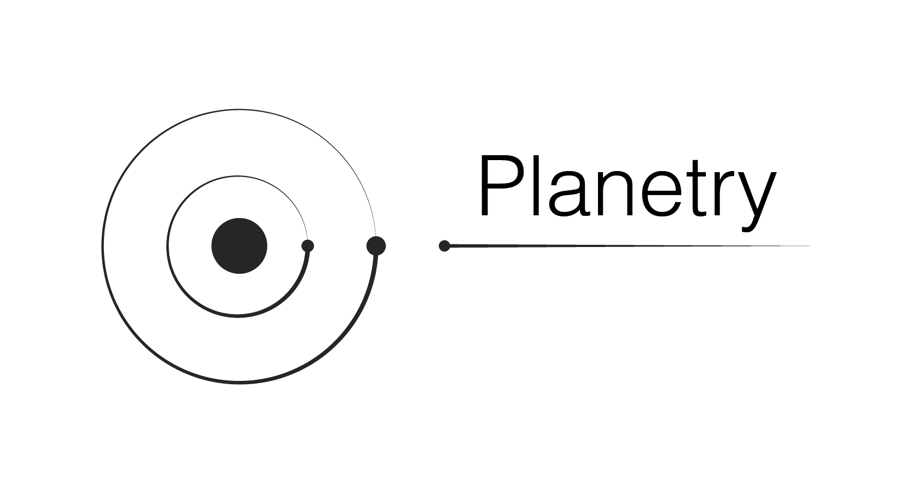
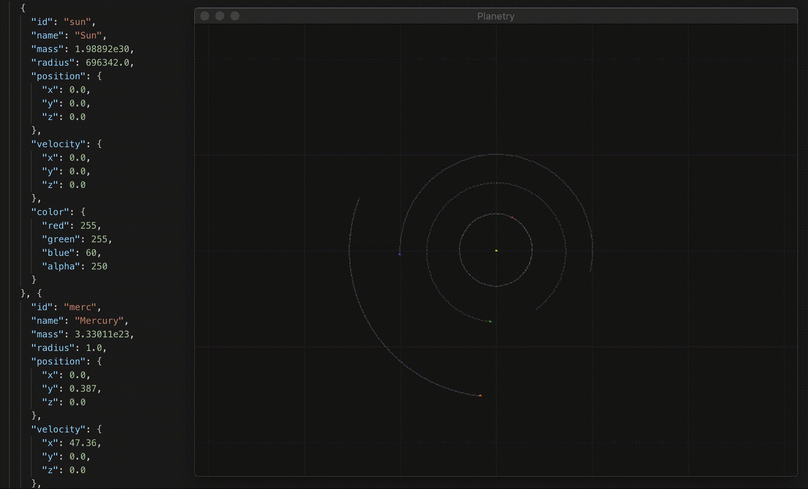

# Planetry

[](https://travis-ci.org/szll/planetry)
[](https://coveralls.io/github/szll/planetry?branch=master)

**ATTENTION:** this project is totally **WORK IN PROGRESS**

Planetry is a simple app for gravitational simulations of objects in space. You can specify the objects or bodys by your own. A scripting system allows you to check for specific events.

For example: you simulate the solar system with the sun and all its planets and add a second star that passes through the solar system. A simple script, written in Lua, can check on each simulation step, when or if Earth moves outside of the habitable zone. If the event occurs it can pause the simulation and display additional information.



## Installation

### External Dependencies

This project needs [SDL2](https://www.libsdl.org) and [Lua 5.1](https://www.lua.org/manual/5.1/) as requirements which have to be installed first.

#### Mac

First install the requirements via [homebrew](https://brew.sh): `brew install dep sdl2 lua@5.1`

#### Linux (tested on Ubuntu)

Just type: `./install-dependencies-linux.sh`

#### Windows

Todo ... I would be more than happy to get help here :D

### Golang dependencies and building

The golang dependencies are managed via [dep](https://github.com/golang/dep). To get the dependencies type: `dep ensure`

To build the executable type: `go build`

## Usage

When the executable was build, you can start the simulation by typing:

```
./planetry
```

> **NOTE**: Planetry loads all the files in `testdata/`. Later you can create projects and load these, but currently if you want to change something in the simulation, just alter the files in `testdata/`.

Feel free to add more Lua scripts or edit `testdata/system.json`.

On runtime, you can use:
 - `y` to zoom out,
 - `x` to zoom in and
 - `SPACE` to pause/unpause

### Describing the simulated scene

Planetry needs data about what it's going to simulate, e.g. the solarsystem. A scene file is this kind of description. The following snipped shows the structure of a scene file:

```json
{
  "version": 1,
  "meta": {
    "units": {
      "position": "au",
      "velocity": "km/s",
      "radius": "km"
    }
  },
  "backgroundColor": {
    "red": 22,
    "green": 22,
    "blue": 22,
    "alpha": 250
  },
  "bodies": [
    {
      "name": "Sun",
      "mass": 1.98892e30,
      "radius": 1.0,
      "position": {
        "x": 0.0,
        "y": 0.0,
        "z": 0.0
      },
      "velocity": {
        "x": 0.0,
        "y": 0.0,
        "z": 0.0
      },
      "color": {
        "red": 255,
        "green": 255,
        "blue": 60,
        "alpha": 250
      }
    },
    ...
  ]
}
```

It consists of four properties:
 - **version** (int): is the version of the scene file structure
 - **meta** (object): meta itself is an object which contains meta data about the scene
   - **units** (object): contains information about the units used for the **bodies** in the current scene file
     - **position** (string): unit used for position values
     - **velocity** (string): unit used for velocity values
     - **radius** (string): unit used for radius value
 - **backgroundColor** (object): defines the scene background color and has the typical color properties: **red**, **green**, **blue**, **alpha**.
 - **bodies** (array of objects): This is the representation of all the objects in the scene like stars or planets.

<!--
  TODO: describe bodies
-->

Example: see `testdata/system.json`

### Lua scripting

Everyone should be able to check for certain events e.g. if Earth moved out of the habitable zone or if Mars reaches a velocity/acceleration above a certain point without changing the application code itself.

To be able to do this, a Lua scripting VM is available. There are functions of the Go simulation scope available inside this VM. The functions can be used in order to get the information you need to write useful scripts.

The following code snipped shows a script, that is will check each simulation week (every 7th step), if the earth moved outside the habitable zone (either to close to or to far away from the sun).

```Lua
habitableZoneCheckDone = false

-- Both functions "getSteps" and "setPaused" as well as "AU" are exposed from the go context
function habitableZone()
  local steps = getSteps()
  if steps > 0 and steps % 7 == 0 and not habitableZoneCheckDone then
    local earth = getBodyByName("Earth")
    local sun = getBodyByName("Sun")
    local d = distance(earth.Position.X, earth.Position.Y, earth.Position.Z, sun.Position.X, sun.Position.Y, sun.Position.Z)  
    
    local toClose = d < AU * 0.95
    local toFar = d > AU * 2.4

    if toClose or toFar then
      if toClose then print("too close to the sun", d / AU, steps / 365) end
      if toFar then print("too far to the sun", d / AU, steps / 365) end
      setPaused(true)
      habitableZoneCheckDone = true
    end
  end
end

-- This function is also availbale to other scripts since it's in the global scope
distance = function (x1, y1, z1, x2, y2, z2)
  local dx = x2-x1
  local dy = y2-y1
  local dz = z2-z1
  return math.abs(math.sqrt(dx*dx+dy*dy+dz*dz))
end
```

> **NOTE**: Each script can only have one "main" function. The "main" function must be the only named function in the script file. If you have to use other functions, please write them as unnamed functions stored in vars, like "distance" in the example above.
The reason is: on file load, planetry will parse the file for one function of the notation "function \<name\>()" and stores this \<name\> in a map, which will be used in the simulation to call this script function. 

> **ATTENTION**: Most Go -> Lua functions will return refrences, so be careful when you alter values of bodies!

#### Functions and constants available in LuaVM

Currently available Go functions in Lua scope are:
 - `getBodyByName(name string) *Body`: returns a body of the current scene by its name; the name is specified in the scene file
 - `getSteps() int`: returns the simulation steps (currently days)
 - `setPaused(paused bool)`: pauses or unpauses the simulation, depending on the `paused` value
 - `createPoint3D(x, y, z float64) *Point3D`: creates a new Point3D
 - `createVector3D(x, y, z float64) *Vector3D`: creates a new Vector3D
 - `createBody(name string, mass, radius float64, position *Point3D, velocity *Vector3D) *Body`: creates a new body`
 - `addBodyToScene(body *Body, red, green, blue, alpha int) err`: adds a new body to the scene

Also the constant value of the astronomical unit `AU` is available in the Lua scope.

## TODO

As you may noticed: this project is in a really early stage of development. Here's the stuff that has to be done next:

- Draw bodies in their real size; not just pixels
- "on pause scripts" that allow to print data when the user or scripts pause the simulation
- Attach camera to object
- Draw name on pause
- Collision
- Alter speed
- Runtime memory functions for scripting
- 3D rendering